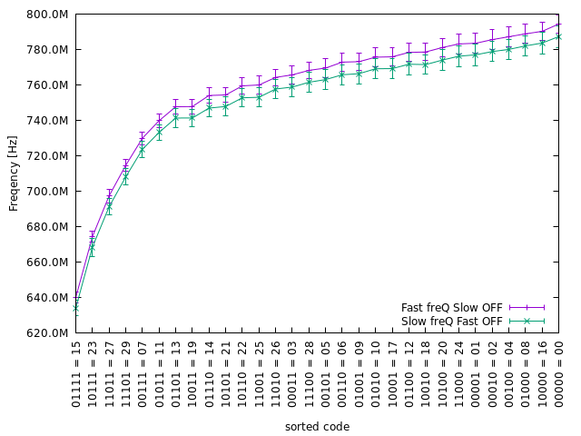
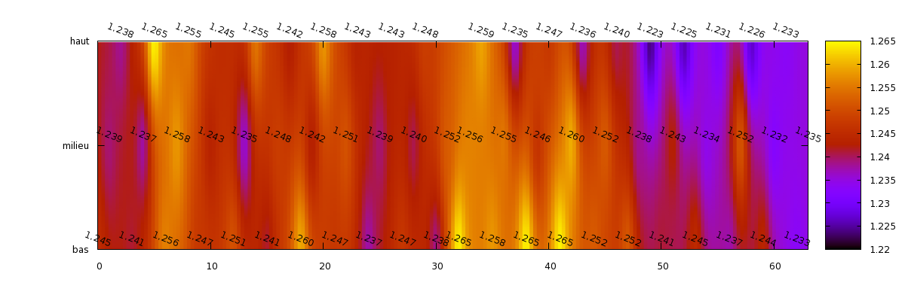

# gnuplotery
my gnuplot tricks gathered here and there

*paraGif* function example
--------------------------
Example of a rotating view of a transfert function. A parameter can be changed when invoking gnuplot, so that, the singularity can be checked.

`gnuplot -e "capL='1000e-15';mapy=1" paraGif.gp -`

`gnuplot -e "capL='100e-15';mapy=1" paraGif.gp -`

*mosCarac* function example
--------------------------

Here is an example of the data extracted from a 10u/0.35u MOS transistor, and plotted in three dimentions, so that one can see clearly, on a single graph, all the region of operation of a transistor : [0] Off (blocked), [3] subth (week inversion), [1] triode (ohmic) and [2] saturation.

*[gantt* function example](./exemple/boxxy.gp)
--------------------------

How to nicely plot time scheddule, so called gantt chart, planning or whatsoever. Thanks to Fabrice G. for its first share.

USAGE : 
Modify the file type2Num.gp to select the corresponding  color to a project name. Update the new_plan.txt to your needs. Warning, each block needs to be separated with two blak lines (not space, tab or so), and each row is separated with a tab (could be customized with gnuplot option : separtor=';' or so.)

Or if you have custom names, just invoke, gnuplot like that:

`gnuplot -e "file='MY_dates.txt'; type2numFile='MY_type.gp'" boxxy.gp -`

*[gaussian fit from time result file* function example ](./exemple/marathon.gp)
--------------------------

Here is an example of the fit of time arrivals of the runners of a marathon. With plotting arrows form label to some position of the curve fit.

*[linear fit* of a list of file ](./INDUCTION/loop_plot.gp)
--------------------------

Example to apply a fit to a list of file. adjusting the rounding first of second to cents of minutes. same color to the datas and the fit, removing the fit label. Works with gnuplot 5.2 (using array).

*simple* [multiplot exemple loop](./exemple/multiplot_modf.gp)
--------------------------

*[exemple of rotate label, sorted file ](./exemple/Slow_alone.gp)
--------------------------

*[exemple](./exemple/ALONE_SF.gp) ALONE_SF.gp file
--------------------------
In this example, i interact with python to format the xtic label with zero padded binary format.
I show also an example to generate automaticaly the picture, while resising the size with convert keeping the resolution.
Remark in this example, the frequency data file are sorted, such as the binary xtic code.

*[exemple Slow_fixed_loopF2.gp](./exemple/Slow_fixed_loopF2.gp)  file
--------------------------
In this example where I change the text of the y2tics to be a function of the one from ytics. I like to see corresponding period as well as frequency value on the same plot.

*[exemple spectrumView1.gp](./exemple/spectrumView1.gp) file
--------------------------
ploting example from spectrum view data

--------------------------
[capacitance repartition with colormap and data on top ](./exemple/mapCap.gp)
--------------------------

